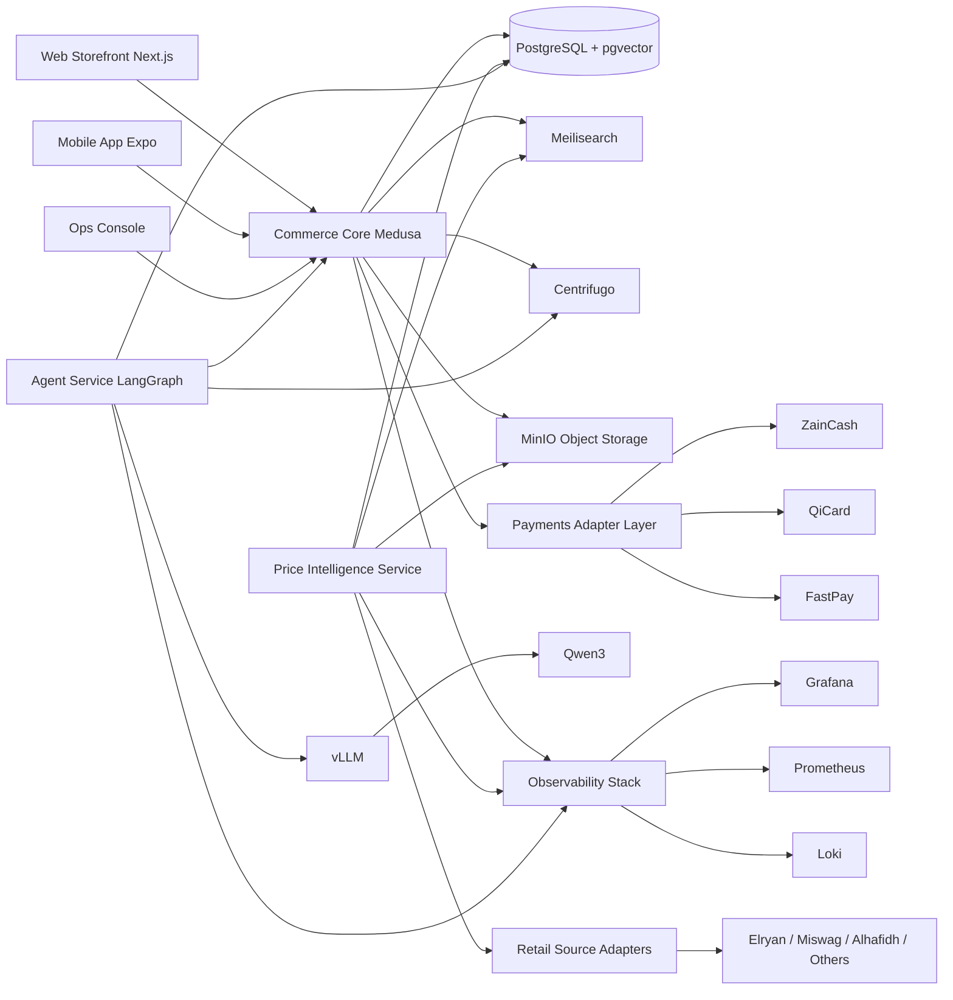
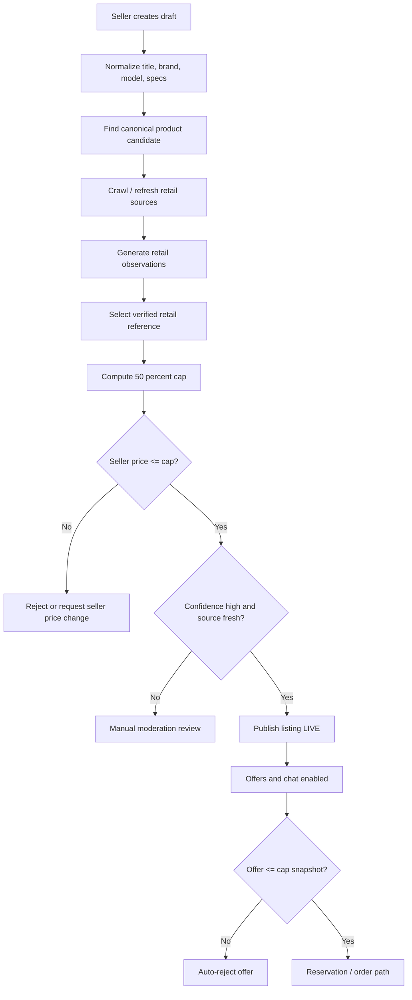

# HalfThePrice Blueprint for Niwa Qimat

## Reality check on the stack

The key decision is not “Laravel vs Node” or “agents vs no agents.” The key decision is whether the platform can cleanly encode **price-verification as the gatekeeper of publication**. That requirement makes the stack less like a normal marketplace and more like a **policy-driven commerce system**. On that criterion, Medusa is the best fit because its modular commerce model and workflow engine are designed for custom transactions and stateful orchestration. Vendure is a credible second choice if your team prefers a more explicit multi-vendor how-to and code-first TypeScript backend. Bagisto is reasonable if your team is already deeply Laravel-native, but it loses points because the official marketplace path is paid and because the default gravity is “retail store with marketplace add-on,” not “policy-first P2P verification engine.” citeturn43search3turn43search7turn34search7turn34search15turn43search2turn43search19turn43search21turn43search0

| Stack option | Commerce core | Strengths | Main weaknesses | Dev effort | Risk |
|---|---|---|---|---|---|
| **Recommended** | **Medusa + Next.js + Expo** | Best fit for custom listing lifecycle, flexible modules, durable workflows, extensible admin, fully open commerce modules | Marketplace logic is custom work, not a prebuilt toggle | Medium | **Lowest strategic risk** |
| **Alternative** | **Vendure + Next.js + Expo** | Excellent TypeScript backend, official multi-vendor guidance, code-first extensibility | More enterprise-flavored, somewhat heavier operationally for a small local launch | Medium-high | Low-medium |
| **Not my first pick** | **Bagisto + Vue/React storefront + optional mobile** | Fast Laravel onboarding, mature ecommerce ecosystem, solid for store-style commerce | Official multi-vendor marketplace is paid; weaker fit for hard publication rules as first-class engine | Medium | Medium |

The comparison above is grounded in Medusa’s official marketplace recipe, module/workflow architecture, and admin extensibility; Vendure’s official multi-vendor marketplace guidance and code-first backend; and Bagisto’s own documentation and marketplace extension pages that label multi-vendor capability as paid. citeturn43search3turn43search7turn34search3turn34search7turn34search15turn37search1turn37search9turn43search2turn43search19turn43search22turn43search21turn43search0

My recommended component stack is below.

| Layer | Recommendation |
|---|---|
| Commerce core | **Medusa 2.x current stable release train** |
| Web storefront | **Next.js 16 LTS train** |
| Mobile | **Expo SDK 56 / React Native 0.85.2** |
| Primary database | **PostgreSQL 18** |
| GIS / geo | **PostGIS latest stable compatible with PG18** |
| Vector | **pgvector 0.8.x** |
| Search | **Meilisearch 1.44.x** |
| Realtime | **Centrifugo 6.8.x** |
| Object storage | **MinIO latest stable** |
| Kubernetes | **k3s latest stable** |
| Postgres operator | **CloudNativePG 1.29** |
| CD | **Argo CD latest stable** |
| Metrics / logs / telemetry | **Prometheus + Loki + OpenTelemetry Collector + Grafana** |
| Retail crawler | **Crawl4AI stable branch, pinned per CI validation** |
| Local LLM serving | **vLLM 0.22.x** |
| Chat / tool-use model | **Qwen3 8B or 14B Instruct** |
| Embeddings | **BGE-M3** |
| Agent orchestration | **LangGraph** |
| LLM gateway | **LiteLLM** only if multi-provider routing is needed |
| Optional AI workbench | **Dify** for internal experimentation, not the system core |

This recommendations table is supported by official release or documentation signals for Next.js, Expo, PostgreSQL, pgvector, Meilisearch, Centrifugo, MinIO, k3s, CloudNativePG, vLLM, Qwen, LangGraph, LiteLLM, and Medusa. The only component I would explicitly **not** put on the critical path is Dify, because it is more useful as an internal experiment surface than as your primary production control plane. citeturn35search8turn7search7turn3search1turn39search0turn42search0turn42search9turn38search2turn38search6turn5search0turn39search19turn41search0turn41search4turn40search0turn40search1turn40search12turn4search0turn41search1turn41search9turn41search2turn41search10turn43search3turn43search9turn41search3turn41search7

## Regulatory and business guardrails

Your mission should be stated in one line inside the repo and inside the product: **“HalfThePrice is a licensed Iraqi marketplace that only publishes live listings priced at or below 50% of verified retail evidence.”** The new Iraqi e-commerce regulation makes that mission legally meaningful because it requires an e-commerce license from the Ministry of Trade, ties operation to a ministry platform process, requires visible trader identity and disclosure, imposes privacy and complaint-handling duties, requires encryption and breach notification, and authorizes suspension or cancellation for prohibited goods or fraudulent activity. citeturn20view1turn20view2turn20view3turn15view1

The non-negotiable business rules should be encoded as system rules, not policy documents humans may forget:

- A listing may exist as a **draft** without proof, but it may **not** become public unless `seller_price_iqd <= verified_retail_iqd * 0.50`.  
- `verified_retail_iqd` must come from a stored evidence pack: source URL, source type, observed price, locale/currency normalization, timestamp, HTML snapshot hash, screenshot hash if needed, parser version, and match confidence.  
- If the product match confidence is below threshold, the listing moves to **manual review**, not to “soft approved.”  
- If the only available source is a marketplace or user-submitted source, the listing stays **unverified** and unseen.  
- Every offer, counter-offer, and agent-generated suggestion must obey the same cap.  
- If retail evidence ages beyond category TTL, the listing becomes **stale** and is automatically hidden until re-verified.  
- Certain categories are launch-blocked until counsel and operations sign off on compliance and sourcing.  
- Manual overrides exist, but they must expire automatically and require named approver, reason, and audit trail.  

These rules are the direct system response to Iraqi licensing, disclosure, privacy, complaint-handling, and anti-fraud obligations, plus the platform’s own core value proposition. citeturn20view1turn20view2turn20view3turn21view0

The main legal and operational risks are below.

| Risk area | What the sources imply | System response |
|---|---|---|
| E-commerce legality | Ministry licensing is required before lawful e-commerce activity in Iraq | Launch only after counsel validates registration path and ministry licensing workflow |
| Consumer disclosure | Identity, license number, contact, payment methods, FAQ, returns, complaints, and delivery timing must be clear | Hard-require these fields before seller activation |
| Data handling | Only necessary data, explicit consent for third-party sharing, secure storage, breach notification | Privacy-by-design, retention schedule, consent ledger, incident runbooks |
| Payments | Electronic payment services are regulated by CBI and should use licensed providers | Integrate licensed gateways; do not invent your own wallet rail |
| Data locality | CBI has publicly pushed electronic payment data processing/preservation inside Iraq | Keep payment-adjacent production data in Iraq and use in-country DR first |
| Advertising | KRI commercial advertising law applies to promotions and ad content | Moderate listing copy, ban misleading comparisons, store approval audit trail |
| Fraud / prohibited goods | Fraudulent activity and prohibited goods create license risk | Category whitelist, serial-number capture, KYC, moderation, takedown SLA |

The regulatory evidence comes from the Iraqi Official Gazette and Ministry of Justice materials on the 2025 e-commerce regulation, Ministry of Justice publication on the 2025 implementing instructions for the electronic signature law, CBI/CBI-related payment regulation materials, and KRI advertising-law commentary. Because English primary texts are incomplete in places, local counsel is still mandatory before production launch. citeturn20view0turn20view1turn20view2turn20view3turn17view0turn16search1turn16search4turn18search0turn18search2turn18search3turn19view0turn24search0turn24search1turn24search2

Payment design needs extra restraint. **ZainCash** publicly documents OAuth2 auth, payment initialization, inquiry, reversal, JWT callbacks, webhooks, IQD-only amounts, and even supports `En`, `Ar`, and `Ku` language codes. **QiCard** publicly advertises a REST API, webhook notifications, and a Flutter bridge/SDK. **FastPay** publicly exposes a developer portal with website, mobile, QR, Flutter, and React Native integration paths. That is enough to build adapters. It is **not** enough to assume that marketplace escrow, split settlement, or stored-value custody for third-party sellers is automatically available to you. So the correct v1 model is: **COD/in-person exchange by default**, **optional gateway prepayment or reservation deposit** on selected categories, and **no full escrow wallet** until the provider contract and counsel explicitly approve it. citeturn9view0turn9view1turn11view1turn10search2turn18search0turn18search2turn18search3

Iraqi retailers already expose these local rails to consumers. Elryan’s public storefront shows payment methods including **Qi Card, FIB, FastPay, ZainCash, and Cash on Delivery**, which is a useful signal for user expectations in the local market. citeturn25search5turn25search9

## System architecture and repo canon

The system should be organized around one rule: **publication is downstream of verification**.



This architecture deliberately keeps the marketplace core, price-intelligence layer, payment adapters, and AI layer **separate**. That separation matters because Medusa handles transactional commerce well, Crawl4AI handles ongoing source collection, payment gateways require independently testable adapters, and the agent layer should be removable without breaking the marketplace. The recommended components are supported by official docs for Medusa, Meilisearch, Centrifugo, MinIO, Crawl4AI, vLLM, LangGraph, and local payment providers. citeturn43search3turn34search15turn38search1turn38search3turn38search2turn40search6turn41search0turn41search1turn9view0turn9view1turn11view1

Your retail-reference strategy should be explicit, audited, and conservative.

| Priority | Source | Best use | Crawl feasibility | Legal / operational risk | Recommendation |
|---|---|---|---|---|---|
| High | **Elryan** | Electronics, appliances, accessories, mainstream branded goods | High for public product pages; merchant API exists for partner workflows | Medium | Primary benchmark source |
| High | **Alhafidh** | Appliances and home electronics from an official Iraqi retailer | High | Medium | Primary source for appliance categories |
| High | **Miswag** | Broad Iraqi catalog coverage, many brands and categories | Medium-high; obey robots and only use public catalog pages | Medium | Secondary source, weighted by seller trust |
| Medium | **ElectroMall** | Electronics-focused Iraqi retail | Medium-high | Medium | Secondary benchmark source |
| Medium | **iCenter Iraq / LG BrandShop / other authorized brand stores** | Premium or brand-specific devices | Medium | Low-medium | Strong tie-breaker sources |
| Medium | **AbuAlu / Total Tech / Arbela** | KRI-focused tech and electronics | Medium | Medium | Good KRI-local expansion sources |
| Low | **Classifieds like Kurd Shopping / OpenSooq** | Used-market sanity checks only | High | High for retail-baseline misuse | Never use as retail reference |

This priority order is based on public store positioning, catalog visibility, payment and support maturity, a public merchant API in Elryan’s case, Miswag’s robots/privacy/seller-portal signals, and the existence of structured KRI/Iraqi tech retailers. Classifieds are useful for market sanity and fraud heuristics, but they should **never** define your retail ceiling because they are not authoritative retail catalog sources. citeturn32view0turn25search1turn27search4turn25search2turn28search0turn28search3turn25search8turn27search0turn30search1turn30search2turn30search4turn33search0turn33search5turn33search12turn33search13turn33search16turn33search3turn33search8

The repository should look like this.

```text
HalfThePrice/
├── AGENTS.md
├── CLAUDE.md
├── README.md
├── docs/
│   ├── ai/
│   │   ├── context.md
│   │   ├── mission.md
│   │   ├── architecture.md
│   │   ├── business-rules.md
│   │   ├── api-standards.md
│   │   ├── coding-standards.md
│   │   ├── testing-policy.md
│   │   ├── security-policy.md
│   │   ├── release-policy.md
│   │   ├── moderation-policy.md
│   │   ├── source-onboarding-policy.md
│   │   ├── payments-policy.md
│   │   ├── runbooks.md
│   │   └── decision-log/
│   └── product/
│       ├── taxonomy.md
│       ├── launch-scope.md
│       ├── pricing-cap-rules.md
│       └── support-playbooks.md
├── apps/
│   ├── web/
│   ├── mobile/
│   └── ops-console/
├── services/
│   ├── commerce/
│   ├── price-intelligence/
│   ├── ai-orchestrator/
│   ├── chat-gateway/
│   ├── notifications/
│   └── workers/
├── packages/
│   ├── contracts/
│   ├── sdk/
│   ├── ui/
│   ├── config/
│   ├── observability/
│   └── test-fixtures/
├── deploy/
│   ├── docker/
│   ├── k3s/
│   ├── argocd/
│   ├── opentofu/
│   └── restore-drills/
├── scripts/
├── skills/
│   ├── backend-change/SKILL.md
│   ├── frontend-change/SKILL.md
│   ├── mobile-change/SKILL.md
│   ├── price-verification-change/SKILL.md
│   ├── crawl-source-onboarding/SKILL.md
│   ├── payment-adapter/SKILL.md
│   ├── moderation-rule-change/SKILL.md
│   ├── bug-fix/SKILL.md
│   ├── data-migration/SKILL.md
│   ├── incident-response/SKILL.md
│   ├── release-check/SKILL.md
│   └── security-review/SKILL.md
└── .github/
    ├── pull_request_template.md
    └── workflows/
```

The repo canon should force AI and human contributors to work in small, auditable units. The root `AGENTS.md` and `CLAUDE.md` should state five immutable rules: never bypass publication gating; never change legal text without a counsel-review flag; never weaken audit logging around price verification or payments; always update tests when business rules change; and always document scope decisions in `docs/ai/decision-log`. That structure mirrors the intent of your reference image, but applies it to the actual high-risk domains in this marketplace. citeturn20view2turn20view3turn9view0

Use one shared `SKILL.md` template everywhere:

```md
# Skill

## Purpose
What this skill changes and why it exists.

## When to use
Clear triggers for invoking this skill.

## Inputs
Required tickets, files, feature flags, env vars, and domain assumptions.

## Files usually touched
Concrete paths.

## Do not
Hard bans for this skill.

## Workflow
Step-by-step implementation flow.

## Acceptance checks
Tests, screenshots, migration checks, logs, rollback notes.

## Output contract
What the PR or patch must contain before completion.

## Escalate when
Conditions that require human approval.
```

And define specialized examples such as `skills/price-verification-change/SKILL.md` with rules like: never change cap math without migration plan; must preserve historical evidence packs; must add unit, integration, and replay tests; must document source impact; must update moderation UX; must include backfill/rollback notes. That is exactly how you make AI productive **without** allowing it to damage the business model.

## Data model, modules, and API surface

The data model should treat a seller’s listing and the “canonical retail product” as separate things. That is the only clean way to enforce a hard retail cap.

| Entity | Critical fields |
|---|---|
| `user` | id, role, locale, phone, status |
| `seller_profile` | user_id, legal_name, display_name, governorate, KYC status, payout preference |
| `seller_document` | seller_id, type, file_key, verified_by, verified_at |
| `category` | id, whitelist_status, retail_ttl_days, verification_policy |
| `canonical_product` | id, brand, model, gtin/mpn, normalized_specs, fingerprint_hash |
| `listing` | id, seller_id, canonical_product_id, condition, accessories, media_status, seller_price_iqd, status |
| `retail_reference` | canonical_product_id, source_name, source_url, observed_price_iqd, stock_state, observed_at, parser_version, evidence_hash |
| `price_verification_run` | listing_id, match_confidence, selected_reference_id, computed_cap_iqd, result, reviewer_id |
| `offer` | listing_id, buyer_id, amount_iqd, status, cap_snapshot_iqd |
| `conversation` / `message` | participants, listing_id, moderation flags, realtime channel |
| `order` | listing_id, buyer_id, seller_id, payment_mode, fulfillment_mode, state |
| `payment_attempt` | order_id, provider, external_ref, provider_status, verified_by_webhook |
| `moderation_case` | subject_type, subject_id, reason, risk_score, owner, SLA |
| `audit_event` | actor, object_type, object_id, action, before, after, correlation_id |

That model is intentionally biased toward verification evidence, auditability, and replayability. If you ever need to prove why a listing was allowed, disallowed, or hidden, you should be able to reconstruct the decision from the database and MinIO evidence bundle alone. That is also compatible with the disclosure, privacy, and anti-fraud obligations in the Iraqi e-commerce framework. citeturn20view2turn20view3

The module map should be equally explicit:

| Module | What it owns |
|---|---|
| Identity and access | customers, sellers, admins, MFA, session policy |
| Seller onboarding | KYC, documents, activation, risk flags |
| Category governance | whitelist, TTLs, matching rules, prohibited goods |
| Listing intake | draft creation, media upload, normalization, submission |
| Price intelligence | crawling, parsing, normalization, matching, retail references |
| Verification engine | cap calculation, publication gate, stale checks, override workflow |
| Search and discovery | filters, typo-tolerant search, semantic assist, rankings |
| Messaging and offers | chat, negotiations, offer caps, moderation hooks |
| Orders and fulfillment | reservation, purchase, COD workflow, returns, disputes |
| Payment adapters | ZainCash, QiCard, FastPay, webhook verification |
| Support and moderation | case handling, fraud review, takedowns, seller quality scores |
| Notifications | push, SMS/WhatsApp abstraction, email, in-app |
| AI services | assistant chat, seller help, moderation assist, source-matching assist |
| Analytics and audit | dashboards, events, quality metrics, audit trails |

The search layer should use **Meilisearch** for buyer-facing retrieval because it gives typo tolerance, multi-criteria ranking, and hybrid search, while the semantic/AI layer should stay on **pgvector** for canonical-product matching and RAG. That split keeps search fast and the data model simple. citeturn38search4turn38search8turn38search1turn39search0

Your primary pricing rule should be:

```text
computed_cap_iqd = floor(0.50 * selected_verified_retail_iqd)

listing publishable only if:
- verification_result == PASS
- seller_price_iqd <= computed_cap_iqd
- selected_verified_retail_iqd is not stale
- canonical product confidence >= threshold
- category whitelist_status == ACTIVE
```

And `selected_verified_retail_iqd` should normally be the **median** of in-stock, non-bundle, model-identical retail observations after outlier filtering, with category-specific TTLs. That is not mandated by law; it is the safest business rule if you want fewer false passes and fewer seller disputes.

The external and internal APIs should stay narrow and explicit.

| Endpoint | Method | Auth | Purpose | Hard rule |
|---|---|---|---|---|
| `/auth/register` | POST | public | create buyer/seller account | seller remains inactive until onboarding |
| `/seller/onboarding/submit` | POST | seller | upload documents and business data | no listings until approved |
| `/seller/listings` | POST | seller | create draft listing | never publishes directly |
| `/seller/listings/{id}/submit` | POST | seller | send draft to verification | triggers verification workflow |
| `/seller/listings/{id}/verification` | GET | seller/admin | read verification state and evidence summary | read-only |
| `/search/listings` | GET | public | buyer search | returns only `LIVE` |
| `/listings/{id}` | GET | public | listing detail | hides evidence internals |
| `/listings/{id}/offers` | POST | buyer | place offer | must reject over-cap offers |
| `/conversations` | POST | auth | start listing conversation | one thread per buyer/listing pair |
| `/conversations/{id}/messages` | POST | auth | send message | passes moderation hooks |
| `/checkout/reservations` | POST | buyer | create reservation / draft order | depends on fulfillment mode |
| `/payments/intents` | POST | buyer | start gateway payment | provider-specific adapter |
| `/webhooks/payments/{provider}` | POST | provider | provider callback | webhook is source of truth |
| `/admin/moderation/queue` | GET | admin | review cases | paginated queue |
| `/admin/listings/{id}/override` | POST | admin | temporary override | reason, approver, expiry mandatory |
| `/internal/verification/replay` | POST | service | replay verification run | audit event mandatory |
| `/internal/source-adapters/{source}/crawl` | POST | service | run source crawl | source policy enforced |
| `/agent/chat` | POST | auth | assistant chat | never final authority on publication |

The payment and realtime parts of this API surface are strongly shaped by provider docs and Centrifugo’s JWT model. ZainCash explicitly recommends webhook events as the source of truth; QiCard emphasizes REST and webhook support; Centrifugo is designed around backend-issued JWTs for secure realtime channels. citeturn9view0turn9view1turn38search3turn38search7

The listing publication flow should look like this.



## Operations, security, and delivery

The delivery strategy should be **Docker first, k3s second, and only then multi-node production**. That gives you fast iteration locally without locking you into a cloud-heavy platform too early.


The open-source infrastructure pieces for this are solid: **k3s** is built for lightweight Kubernetes deployments, **CloudNativePG 1.29** is now GA for PostgreSQL operations in Kubernetes, and **Argo CD** remains the simplest GitOps controller for this kind of environment. For a local company that wants control without giant-cluster complexity, this is the right balance. citeturn5search0turn39search19turn39search7turn6search3

Run the environments like this:

- **Development**: Docker Compose on laptops or dev servers; local Postgres, Meilisearch, MinIO, Centrifugo, Medusa, and mock payment adapters.
- **Staging**: single-node k3s with CloudNativePG, real payment sandboxes, real crawl jobs against a reduced source list.
- **Production**: three-node k3s control/data plane, separate PostgreSQL storage class, MinIO with versioned buckets, dedicated worker pool for crawling and AI jobs, and a second Iraqi DR site.
- **Disaster recovery**: warm standby in a second Iraqi city; if you ever use out-of-country encrypted backups, keep them non-payment and counsel-approved.

Backups and DR should be boring, frequent, and tested. Use **CloudNativePG** for continuous archiving/WAL-based recovery to object storage, **MinIO** for evidence and media retention, immutable retention on evidence buckets, nightly logical exports for compliance review, and monthly restore drills from scratch. Target **RPO 15 minutes** for transactional data and **RTO 2 hours** for single-node failure, **8 hours** for full-site restore. The exact numbers are design targets, but the underlying capabilities are directly supported by CloudNativePG’s PostgreSQL lifecycle management and MinIO’s S3-compatible object layer. citeturn39search7turn39search19turn38search2turn38search6

Observability should not be optional, because your most dangerous failures are **silent**: stale price references, parsing drift, webhook failures, and “published when it should have been blocked.” Use **Prometheus** for metrics, **Loki** for logs, **Grafana** for dashboards, and **OpenTelemetry Collector** for unified instrumentation. Build first-class dashboards for: verification pass rate, stale-listing count, per-source crawl freshness, payment webhook lag, moderation SLA, offer rejection reasons, and agent fallback rate. citeturn5search1turn5search2turn5search3

Security must be designed around the high-risk edges, not aesthetics. Use short-lived signed media-upload URLs, signed Centrifugo tokens, MFA for admins, environment isolation for payment secrets, immutable audit events for override actions, and network separation so the crawler cannot directly mutate live commerce tables. The AI layer must never receive unrestricted DB credentials; it should talk only to bounded internal APIs. The payment adapters must verify webhook authenticity before state changes, exactly as ZainCash’s callback/JWT guidance requires. citeturn38search3turn38search7turn9view0

The testing matrix is where you make the business real.

| Test type | Minimum scope |
|---|---|
| Unit | cap calculation, normalization, source TTL logic, offer rejection, override expiry |
| Integration | crawl parse → retail reference → verification run → publication state |
| E2E | seller onboarding, listing submission, moderation, buyer search, offer flow, payment callback flow |
| Replay / regression | frozen HTML snapshots from every source; parser changes must replay old evidence |
| Security | authz tests, webhook signature tests, signed URL expiry, RBAC, injection and SSRF coverage |
| Performance | search latency, verification queue throughput, realtime message fanout |
| Disaster recovery | backup restore, WAL recovery, evidence-bucket restore, region/site failover drill |

The sample price-verification cases that matter most are these:

| Case | Expected result |
|---|---|
| Exact GTIN/model match from two authorized sources | pass using filtered median retail |
| Same brand but wrong storage/RAM variant | fail match |
| Bundle vs standalone product | bundle excluded from cap calculation |
| Retail source stale beyond TTL | listing hidden or blocked |
| Seller edits price upward after publish | auto-hide if over cap |
| Buyer offer above cap snapshot | auto-reject |
| Manual override reaches expiry | listing auto-hidden pending re-review |
| Source parser changes | replay suite must produce same decision on frozen evidence unless migration approved |

The deployment checklist should be short and mandatory: legal review signed off; licensing path validated; category whitelist loaded; payment sandbox and webhook verification tested; source adapters replay-tested; backup restore drill passed; observability dashboards green; moderation SLA owners assigned; incident runbooks printed and stored.

## Roadmap, resources, and confidence

The phased path to production should be intentionally narrow.

| Phase | Duration | What ships |
|---|---|---|
| Foundation | 4–6 weeks | monorepo, Medusa core, auth, seller onboarding shell, Docker dev env, source-adapter framework, evidence storage, legal checklist |
| Verification-first MVP | 8–10 weeks | draft listings, canonical product matching, source crawling, verification gate, moderation queue, search, buyer browse, chat, offer caps |
| Controlled launch | 6–8 weeks | local payments, reservation/COD flows, notifications, analytics, support console, replay tests, staging-to-k3s promotion |
| Hardening | 4–6 weeks | DR drills, fraud tooling, seller quality scoring, category expansion, agent assist for support and source matching |
| Mobile and AI enrichment | 6–8 weeks | Expo mobile app, assistant chat, seller copilot, moderation assist, semantic matching improvements |

The correct launch sequence is **web first, mobile second, AI third**. A PWA/web launch gives you the operational learning you need without mobile-release friction. Expo is still the right mobile path later because the current stable release train is mature and aligned with recent React Native releases, but it should not block the marketplace foundation. citeturn7search7turn35search8

A realistic team for a professional fast build is:

| Role | Load |
|---|---|
| Product / founder / marketplace ops lead | 1 |
| Tech lead / solutions architect | 1 |
| Full-stack backend engineer | 1 |
| Frontend / mobile engineer | 1 |
| Data / crawler / search engineer | 1 |
| QA / automation / release engineer | 1 |
| DevOps / SRE | 0.5 |
| Trust & safety / moderation ops | 1 |
| Fractional local counsel | 0.2 |

That is roughly **6–7 effective heads** for **6–8 months** to reach a serious v1. If you cut below that, do not cut QA or moderation; cut mobile-first ambitions.

A sensible first-year infrastructure budget, with no cloud-vendor lock-in, looks like this:

| Item | Year-one estimate |
|---|---|
| Core production and staging compute | \$8k–\$14k |
| Storage, backup, and DR | \$4k–\$8k |
| Networking / colocation / local hosting overhead | \$4k–\$10k |
| Observability and security tooling overhead | \$1k–\$4k |
| Optional local GPU box for vLLM | \$4k–\$10k |
| Total without local GPU | **\$17k–\$36k** |
| Total with one serious local GPU server | **\$22k–\$46k** |

Those are broad ranges because you left cloud/vendor constraints open and because local Iraqi/KRI hosting economics vary. The important point is that this is still comfortably in the range of a **local but powerful** company if you keep the category scope tight and avoid premature escrow, overbuilt AI, or giant-scale infrastructure.

The main open questions and limitations are these:

- I found strong evidence for the **legal framework**, but not enough public operational detail on the current real-world status of the Ministry of Trade’s e-commerce licensing platform to treat it as “ready, frictionless, and known-good.” citeturn20view1turn23search0
- I found public gateway docs for **ZainCash, QiCard, and FastPay**, but not enough public evidence to declare marketplace escrow or split settlements safely available. Treat that as **unknown until contracts and counsel confirm**. citeturn9view0turn9view1turn11view1
- I found useful source signals for Iraqi/KRI retail sites, but crawl permissions vary. Each adapter needs its own legal/robots/ToS review before production use. Miswag’s public robots file is a good sign for bounded public crawling, but it is not a blanket permission slip for aggressive extraction. citeturn27search0turn30search1turn28search0
- I found strong capabilities for the chosen open-source AI stack, but **Kurdish answer quality** should be benchmarked locally before you rely on the agent for customer-facing automation. Keep agents advisory at first. citeturn40search0turn40search12turn41search1

**Confidence: 96/100.** I am confident this is the strongest mostly-ready, open-source-first foundation for Niwa Qimat / HalfThePrice **if** you launch as a tightly scoped, verification-first marketplace and treat payments, licensing, and crawling permissions conservatively. I am **not** confident enough to claim 99%+ until you have local counsel confirmation on licensing/escrow details and signed onboarding guidance from at least one Iraqi payment provider.