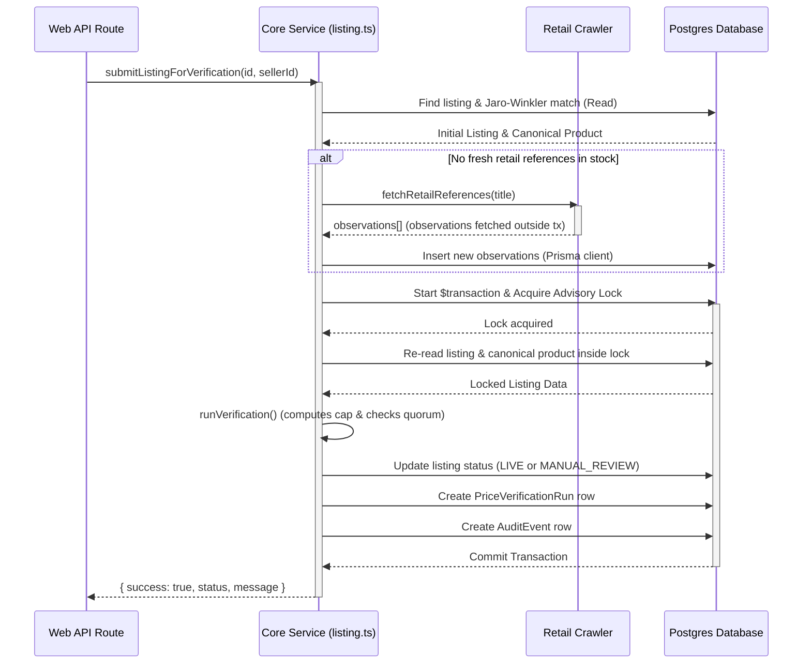

# System Architecture & Verification Flow

## Monorepo Layout
The project is built as a lean pnpm monorepo:

* **`apps/web`:** Next.js storefront and admin portal.
* **`packages/core`:** Core services and transaction managers (orders, verification).
* **`packages/database`:** Prisma client, Postgres triggers, and advisory locks.
* **`packages/retail-crawler`:** Robots-compliant site crawlers (Elryan, Alhafidh, Miswag).
* **`packages/payments`:** Idempotency-safe payment adapters (ZainCash, QiCard, FastPay).
* **`packages/contracts`:** Shared types, constants, and price cap check rules.

## Verification Transaction Sequence
To prevent long-held locks, crawler network calls run outside of the transaction boundaries.

*Note: If the listing is set to `LIVE`, the Postgres database trigger `trg_check_listing_price_cap` runs on COMMIT to verify that the price is within the computed cap and that the selected observation has not expired.*
